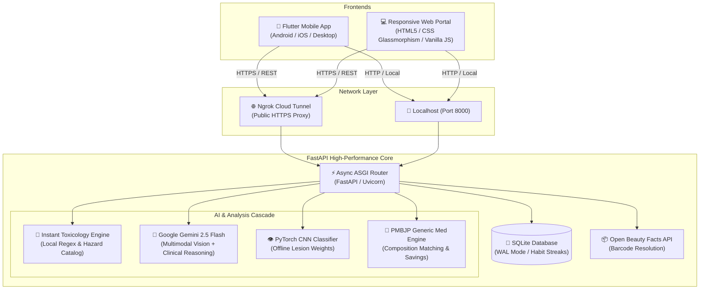

# FACEIT — AI Clinical Dermatology, Facial Symmetry & Jan Aushadhi Medicine Platform

<div align="center">

[](https://fastapi.tiangolo.com/)
[](https://flutter.dev/)
[](https://python.org)
[](https://pytorch.org/)
[](https://aistudio.google.com/)
[](https://sqlite.org/)
[]()

**A clinically oriented, privacy-first AI healthcare ecosystem fusing Computer Vision, Multi-modal LLMs, Cosmetic Toxicology Screening, and Pradhan Mantri Bhartiya Janaushadhi Pariyojana (PMBJP) Generic Medicine Substitution.**

[Features](#-key-features) • [System Architecture](#-system-architecture) • [Web & Mobile Portals](#-multi-platform-ecosystem) • [Quick Start](#-getting-started) • [API Reference](#-api-documentation) • [Live Deployment](#-live-cloud-deployment)

</div>

---

## 📌 Executive Overview & Smart India Hackathon (SIH) Mission

**FACEIT (AURA)** addresses two critical healthcare challenges:
1. **Diagnostic Bottlenecks in Dermatology**: High consultation costs and acute scarcity of board-certified dermatologists in Tier-2/3 towns lead to misdiagnoses, untreated conditions, and reliance on unverified cosmetic remedies.
2. **Crippling Out-of-Pocket Pharmaceutical Costs**: Patients frequently purchase expensive branded medicines when equivalent, clinically identical generic formulations under India's **Jan Aushadhi (PMBJP)** scheme exist at **50% to 90% lower prices**.

**FACEIT delivers an end-to-end, high-speed solution:**
- Instant lesion and skin disease classification with actionable differential diagnoses.
- Real-time product ingredient toxicology screening (comedogenic rating, allergens, carcinogens) with one-tap Clinical PDF export.
- AI-driven prescription OCR and generic medicine substitution engine with transparent price savings calculations.
- Comprehensive facial geometry, bilateral symmetry analysis, and 90-day progress metrics.
- Dual interface: A feature-rich **Flutter mobile app** for patients and a lightweight, zero-install **responsive Web Portal** for rapid web and desktop access.

---

## 🚀 Key Features

### 1. 💊 Jan Aushadhi Generic Medicine Alternative Engine
- **Prescription & Medicine OCR**: Upload an image or type a branded medication name (e.g., *Cetaphil Gentle Skin Cleanser*, *Allegra 120mg*, *Augmentin 625 Duo*, *Sebogel*).
- **Composition-Level Matching**: Identifies active pharmaceutical ingredients (APIs), strength, and therapeutic class.
- **50%–90% Price Slash**: Compares expensive market MRPs with subsidized Jan Aushadhi pricing (e.g., ₹180 vs ₹18).
- **Clinical Safety Alerts**: Displays contraindications, common side effects, dosage guidance, and pregnancy risk categories.
- **Jan Aushadhi Kendra Locator**: Guides patients to the nearest authorized government generic dispensary.

### 2. 🧪 Cosmetic Toxicity & Ingredient Scanner
- **Dual Input Modes**: Scan product barcodes directly via the **Open Beauty Facts API** or photograph/paste the ingredient list via camera OCR.
- **Hazard Tiering**: Classifies ingredients into **Safe**, **Moderate Hazard**, or **High Toxicity** based on peer-reviewed dermatological datasets.
- **Acne & Allergy Profiler**: Flags comedogenic ratings (0 to 5), endocrine disruptors, sulfates, parabens, synthetic fragrances, and known carcinogens.
- **Clinical PDF Export**: Generates a shareable, formatted PDF report complete with severity indicators and tailored recommendations.

### 3. 🔬 Skin Lesion & Condition Analysis (<1.5s Latency)
- **High-Speed AI Cascade**: Employs an ultra-fast tiered cascade:
  1. *Tier 1 (Instant)*: Local rule-based classifier and toxicology lookup (sub-50ms).
  2. *Tier 2 (Vision-LLM)*: Google Gemini 2.5 Flash with optimized concise clinical schema (0.9s–1.8s).
  3. *Tier 3 (Offline Deep Learning)*: Custom PyTorch CNN classifier for offline fallback.
- **Clinical Metrics**: Severity grading (Mild/Moderate/Severe), estimated recovery timeline, potential triggers, non-comedogenic routine recommendations, and medical consultation urgency flags.

### 4. 📐 Facial Geometry & Biometric Symmetry Analysis
- Bilateral facial landmark tracking to calculate symmetry percentages.
- Computes jawline angle, canthal tilt (neutral/positive/negative), cheekbone prominence, and skin texture uniformity.
- **90-Day Glow-Up Tracker**: Interactive morph comparison slider and structured milestone recommendations.

### 5. 🤖 Aura AI Clinical Assistant & Routine Conflicts
- Real-time chatbot trained to assess skincare compatibility.
- **Conflict Detector**: Alerts users if their routine combines conflicting actives (e.g., *Retinol + Salicylic Acid* or *Vitamin C + Niacinamide at high concentrations*).

### 6. 📅 Habit Streaks & Nearby Clinic Locator
- Morning & evening skincare habit tracker backed by SQLite (WAL mode) with streak preservation.
- Integrated GPS directory of certified dermatologists and specialized clinics.

---

## 🏗 System Architecture



---

## 💻 Multi-Platform Ecosystem

| Component | Directory | Technology | Key Capabilities |
|---|---|---|---|
| **Mobile App** | [`mobile_app/`](mobile_app/) | Flutter 3.x, Dart, Material 3, Lottie, PDF | Full native camera integration, offline caching, responsive horizontal/vertical layout, biometric morphology slider, habit streaks. |
| **Web Portal** | [`web_portal/`](web_portal/) | Vanilla JS, CSS3 Glassmorphism, HTML5 | Zero-build, lightweight client. Instant toxicity checker, generic medicine price-slash engine, real-time backend status pulse. |
| **Backend Service** | [`backend/`](backend/) | FastAPI, Python 3.11+, PyTorch, Uvicorn | Async request handling, tiered fallback inference cascade, SQLite WAL storage, Jan Aushadhi database. |

---

## 📂 Repository Structure

```
FACEIT/
├── backend/
│   ├── main.py                     # FastAPI core, endpoints, AI cascade & error handlers
│   ├── med_catalog.py              # Jan Aushadhi generic catalog & price mapping engine
│   ├── models.py                   # Pydantic schemas & SQLite data models
│   ├── generate_model.py           # PyTorch skin classifier definition & weights builder
│   ├── train_real_model.py         # PyTorch training & evaluation pipeline
│   ├── models/                     # Trained weights (.pth)
│   ├── requirements.txt            # Python dependencies
│   └── .env.example                # Environment variables template
├── mobile_app/
│   ├── lib/
│   │   ├── main.dart               # Flutter application entrypoint & theme
│   │   ├── config.dart             # Centralized backend URL & API routes
│   │   ├── screens/
│   │   │   ├── med_scanner_screen.dart       # Jan Aushadhi generic alternative screen
│   │   │   ├── ingredient_scanner_screen.dart # Toxicity & barcode scanner with PDF export
│   │   │   ├── facial_analyzer_screen.dart   # Symmetry & facial geometry analysis
│   │   │   ├── check_skin_flow.dart          # Skin condition diagnosis workflow
│   │   │   ├── chatbot_screen.dart           # Aura AI interactive coach
│   │   │   ├── skin_tracker_screen.dart      # Habit tracker & routine streak
│   │   │   └── dermatologist_screen.dart     # Clinic & dermatologist locator
│   │   └── widgets/                # Reusable UI widgets, badges & animations
│   ├── assets/                     # Lottie animations, icons & demo media
│   └── pubspec.yaml                # Flutter project specifications & dependencies
├── web_portal/
│   ├── index.html                  # Responsive Web Portal structure
│   ├── styles.css                  # Modern glassmorphism UI & responsive styles
│   └── app.js                      # Client logic, live API connectors & sample presets
├── launch_aura_project.bat         # Automated one-click project launcher (Windows)
├── start_live_server.bat           # One-click live server + Ngrok tunnel runner
├── .gitignore                      # Git exclusion rules (secrets, venv, databases, docx)
└── README.md                       # Comprehensive documentation
```

---

## ⚡ Getting Started

### Prerequisites

Ensure you have the following installed on your machine:
- **Python**: Version 3.10 or 3.11 ([Download Python](https://www.python.org/downloads/))
- **Flutter SDK**: Version 3.19+ ([Install Flutter](https://docs.flutter.dev/get-started/install))
- **Google Gemini API Key**: Free tier available on [Google AI Studio](https://aistudio.google.com/)
- *(Optional)* **Ngrok**: For exposing your local server to mobile devices over the internet ([Download Ngrok](https://ngrok.com/))

---

### 1. Backend Setup

```bash
# 1. Navigate to the backend directory
cd backend

# 2. Create and activate a Python virtual environment
python -m venv venv

# Windows:
.\venv\Scripts\activate
# macOS / Linux:
source venv/bin/activate

# 3. Install dependencies
pip install -r requirements.txt

# 4. Configure environment variables
copy .env.example .env     # On Windows
cp .env.example .env       # On macOS/Linux
```

Open `backend/.env` and insert your Gemini API Key:
```env
GEMINI_API_KEY=AIzaSy...your_gemini_api_key_here
```

Start the FastAPI backend:
```bash
uvicorn main:app --host 0.0.0.0 --port 8000 --reload
```

- **API Base URL**: `http://localhost:8000`
- **Interactive Swagger Docs**: `http://localhost:8000/docs`
- **Alternative ReDoc**: `http://localhost:8000/redoc`

---

### 2. Web Portal Setup

The web portal requires **no build step** and runs in any modern browser:

```bash
# Option A: Open directly in your browser
start web_portal/index.html   # Windows
open web_portal/index.html    # macOS

# Option B: Serve via Python HTTP server
cd web_portal
python -m http.server 3000
```
Visit `http://localhost:3000` in your web browser.

---

### 3. Mobile App Setup (Flutter)

```bash
# 1. Navigate to the mobile app directory
cd mobile_app

# 2. Fetch Flutter packages
flutter pub get

# 3. Configure backend endpoint
# Open lib/config.dart and verify the backendUrl:
# - For local Android Emulator: 'http://10.0.2.2:8000'
# - For local iOS Simulator:    'http://localhost:8000'
# - For Physical Device/Cloud:  'https://your-ngrok-url.ngrok-free.dev'

# 4. Launch the application
flutter run
```

---

### 4. One-Click Windows Launchers

For presentations and testing on Windows:

- **`start_live_server.bat`**: Starts the Uvicorn FastAPI backend on port 8000 and automatically establishes an active **Ngrok Cloud Tunnel** for physical mobile devices.
- **`launch_aura_project.bat`**: Launches the backend, opens the Web Portal in your browser, and triggers the Flutter client.

---

## 📡 API Documentation

### Core Endpoints Reference

| Method | Route | Description | Request Payload | Response Highlights |
|---|---|---|---|---|
| `GET` | `/health` | Health check & system status | *None* | `{"status": "ok", "app": "FaceIt (AURA)"}` |
| `POST` | `/search-generic-med` | Search Jan Aushadhi generic alternatives | Form: `query` (string) | Branded vs Generic price, composition, savings %, usage |
| `POST` | `/scan-medicine-prescription` | Prescription / medicine label OCR & match | `multipart/form-data`: `file` | Detected medicines, composition, Jan Aushadhi alternatives |
| `GET` | `/all-generic-meds` | Retrieve complete generic catalog | *None* | Array of all available PMBJP medicines |
| `POST` | `/scan-ingredients` | Barcode or raw ingredient text toxicity audit | Form: `barcode`, `ingredients_text` | Safety score, hazard counts, comedogenic rating, breakdown |
| `POST` | `/analyze` | Skin condition & lesion diagnosis | `multipart/form-data`: `image` | Condition, confidence %, severity, recovery days, routine |
| `POST` | `/analyze-face` | Facial geometry & bilateral symmetry | `multipart/form-data`: `image` | Symmetry %, jawline angle, canthal tilt, 90-day plan |
| `POST` | `/chatbot` | Aura AI conversational skincare advisor | JSON: `{"message": "string"}` | Conversational clinical advice, routine conflict warnings |
| `GET` | `/streak` | Current habit streak status | *None* | Current streak, best streak, today's completion status |
| `POST` | `/streak/complete` | Record daily skincare routine completion | *None* | Updated streak metrics and congratulations |
| `GET` | `/dermatologists` | Nearby verified dermatologists & clinics | *None* | Clinic list, distance, ratings, address |

---

## 🛡️ Clinical Disclaimer & Data Privacy

> [!IMPORTANT]
> **Medical Notice**: FACEIT (AURA) is an educational, triage, and cosmetic analysis decision-support tool. It is not intended to replace formal clinical diagnosis, professional medical advice, or treatment by certified dermatologists or licensed medical practitioners.

- **Privacy-First Processing**: Images uploaded for analysis are processed transiently in memory for inference and are not sold, distributed, or repurposed for third-party commercial training.
- **Local Fallbacks**: Basic toxicology lookups and routine conflict evaluations are executed locally without external cloud dependencies.

---

## 🤝 Contributing

Contributions to improve clinical datasets, add new PMBJP generic formulations, or optimize machine learning pipelines are welcome!

1. Fork the repository
2. Create your feature branch (`git checkout -b feature/amazing-feature`)
3. Commit your changes (`git commit -m 'feat: add amazing feature'`)
4. Push to your branch (`git push origin feature/amazing-feature`)
5. Open a Pull Request

---

## 📄 License

This project is developed for evaluation, demonstration, and research in connection with the **Smart India Hackathon (SIH)**. All rights reserved.
